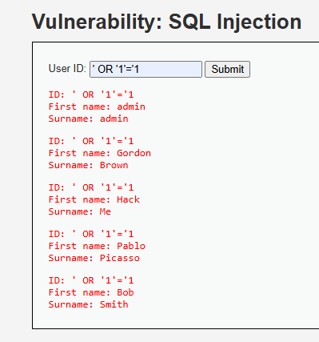

# 02_sqli_lopeli

## Inyección SQL (SQLi)

### 1. Evidencia de explotación

La inyección SQL permite alterar la consulta del sistema para recuperar información no autorizada. En DVWA, el payload clásico expone que el servidor concatena entrada de usuario sin parametrización.



### 2. Por qué funciona

La vulnerabilidad aparece cuando la aplicación construye consultas SQL mediante concatenación directa. Si la entrada del usuario se interpreta como parte de la sentencia, el atacante puede modificar la lógica del `WHERE`, saltarse autenticación o extraer registros sensibles.

Ejemplo de payload usado:

```text
' OR '1'='1
```

En un portal de clientes esto puede exponer nombres, correos, hashes de contraseña, saldos y relaciones entre usuarios.

### 3. CVSS v3.1

- Vector sugerido: `AV:N/AC:L/PR:N/UI:N/S:U/C:H/I:H/A:L`
- Severidad: Crítica
- Puntaje estimado: `9.8`

### 4. Prevención

- Usar consultas parametrizadas o prepared statements.
- Validar tipos de datos en backend.
- Evitar construir SQL por concatenación.
- Limitar privilegios de la cuenta de base de datos.

### 5. Mitigación

- Monitorear errores SQL y patrones anómalos.
- Registrar intentos de inyección en logs centralizados.
- Aplicar WAF con reglas para SQLi.
- Rotar credenciales expuestas o comprometidas.

### 6. Impacto para PagaFacil

Una SQLi en una fintech puede permitir fuga masiva de datos de clientes, enumeración de cuentas y preparación de fraude financiero. El impacto es alto por la sensibilidad de los activos involucrados.
