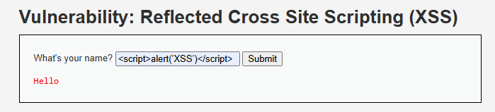

# 03_xss_lopeli

## Cross-Site Scripting (XSS)

### 1. Evidencia de explotación

XSS reflejado ejecuta JavaScript en el navegador de la víctima cuando la entrada no es escapada correctamente.



### 2. Por qué funciona

El problema surge cuando el contenido enviado por el usuario se inserta en el HTML sin codificación contextual. El navegador interpreta el payload como código, no como texto.

Ejemplo de payload usado:

```html
<script>alert('XSS')</script>
```

En un escenario real, este vector puede robar sesiones, manipular formularios, hacer acciones en nombre del usuario o desfigurar contenido.

### 3. CVSS v3.1

- Vector sugerido: `AV:N/AC:L/PR:N/UI:R/S:C/C:H/I:H/A:N`
- Severidad: Alta
- Puntaje estimado: `8.2`

### 4. Prevención

- Escapar salida según el contexto HTML, atributo, JavaScript o URL.
- Sanitizar contenido rico con librerías validadas.
- Aplicar Content Security Policy.
- Evitar insertar datos de usuario con `innerHTML` o equivalentes inseguros.

### 5. Mitigación

- Invalidar sesiones activas ante evidencia de robo.
- Revisar logs de navegación y eventos anómalos.
- Reducir el alcance de cookies sensibles con `HttpOnly`, `Secure` y `SameSite`.

### 6. Impacto para PagaFacil

En una fintech, XSS compromete la confianza del portal, permite suplantación de clientes y puede activar fraudes de sesión o transacciones.
