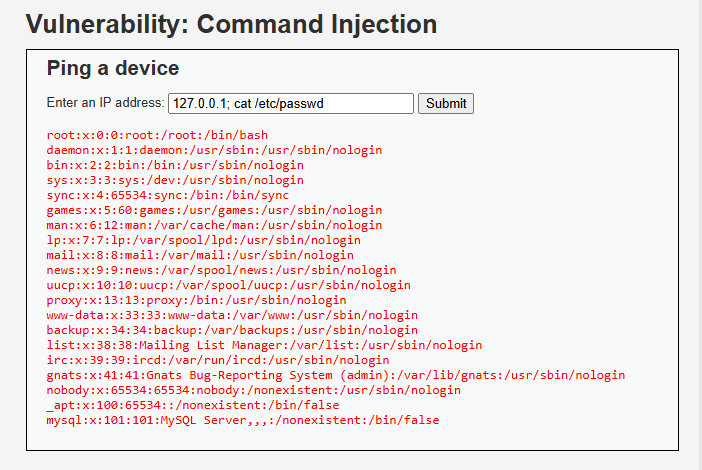

# 04_comandos_lopeli

## Inyección de comandos

### 1. Evidencia de explotación

La inyección de comandos permite ejecutar instrucciones del sistema operativo si la aplicación pasa entrada de usuario a una shell sin control.



### 2. Por qué funciona

Ocurre cuando el backend arma comandos del sistema concatenando parámetros externos. El intérprete procesa caracteres especiales como separadores de comandos y termina ejecutando instrucciones adicionales.

Ejemplo de payload usado:

```text
127.0.0.1; cat /etc/passwd
```

El resultado puede incluir lectura de archivos, ejecución remota de comandos y escalamiento del incidente hacia una toma de control del servidor.

### 3. CVSS v3.1

- Vector sugerido: `AV:N/AC:L/PR:N/UI:N/S:U/C:H/I:H/A:H`
- Severidad: Crítica
- Puntaje estimado: `9.8`

### 4. Prevención

- No invocar shells con entrada directa del usuario.
- Usar APIs del lenguaje que reciban argumentos separados.
- Validar con listas blancas de parámetros permitidos.
- Ejecutar procesos con cuentas de menor privilegio.

### 5. Mitigación

- Aislar el servicio afectado.
- Revisar procesos, conexiones salientes y archivos manipulados.
- Corregir permisos y restringir acceso al sistema operativo.
- Rotar claves o secretos expuestos por el servidor.

### 6. Impacto para PagaFacil

La inyección de comandos puede comprometer el servidor completo, afectar disponibilidad y abrir la puerta a exfiltración de datos o persistencia del atacante.
